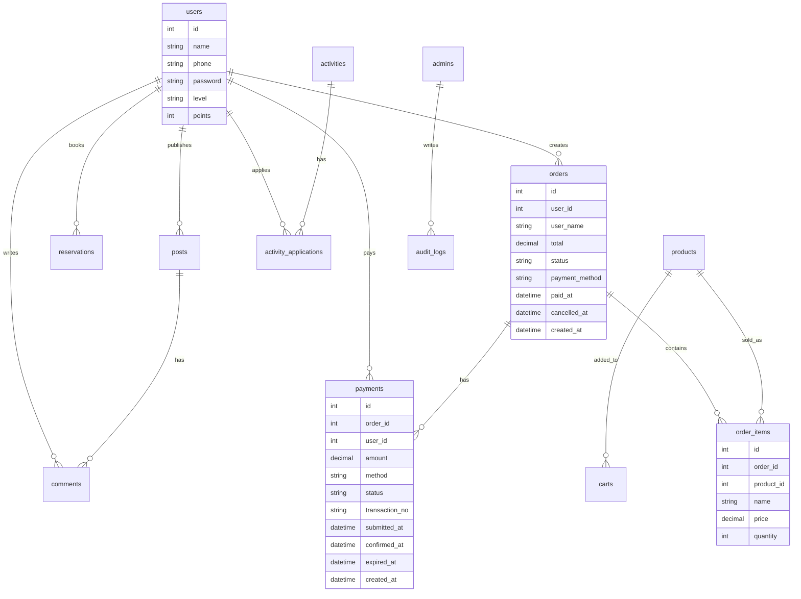

# 数据库 ER 图说明

## 主要实体关系

## 订单与支付状态

`orders.status` 用于描述订单生命周期：

| 状态 | 含义 |
| --- | --- |
| `pending_payment` | 已下单，等待用户支付 |
| `payment_review` | 用户已提交支付，等待管理员确认收款 |
| `paid` | 管理员已确认收款 |
| `cancelled` | 用户取消或支付失败 |
| `completed` | 订单完成 |

`payments.status` 用于描述支付记录生命周期：

| 状态 | 含义 |
| --- | --- |
| `unpaid` | 支付记录已创建，用户尚未提交 |
| `submitted` | 用户点击“我已支付” |
| `confirmed` | 管理员确认收款 |
| `failed` | 支付被驳回或取消 |
| `expired` | 支付二维码超时 |

## 表设计说明

- `orders` 是订单主表，保存用户、金额、订单状态和支付完成时间。
- `order_items` 是订单明细表，保存购买商品、价格和数量。
- `payments` 是支付记录表，一笔订单可以多次创建模拟支付记录，后台以最新有效记录进行审核。
- `reservations` 保存座位、日期、时段、人数和状态，用于前台预约与后台管理。
- `posts` 与 `comments` 保存社区内容，评论带审核状态。
- `audit_logs` 保存关键后台和用户操作，支持后台实时日志页面。

## Windows MySQL 兼容

项目提供 `database/coffee_book_windows_mysql.sql`，字段使用 `utf8mb4` 字符集，适配 Windows 本地 MySQL 导入。后端启动时也会通过 `backend/src/shared/mysql.js` 自动创建或完善业务表结构。
